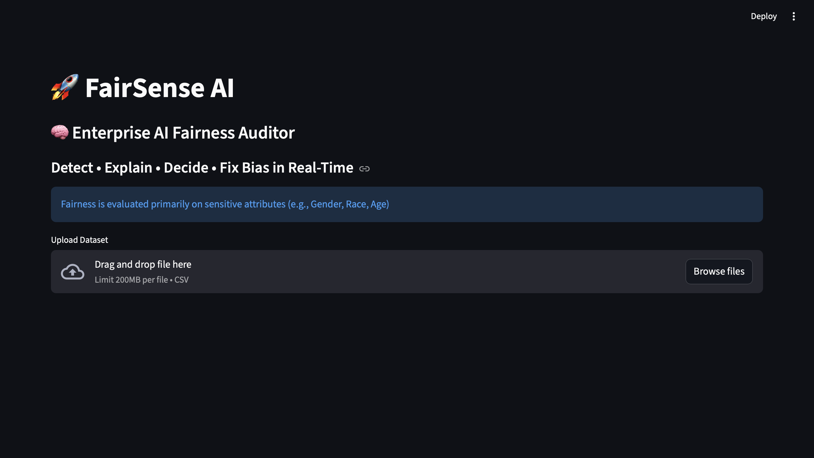
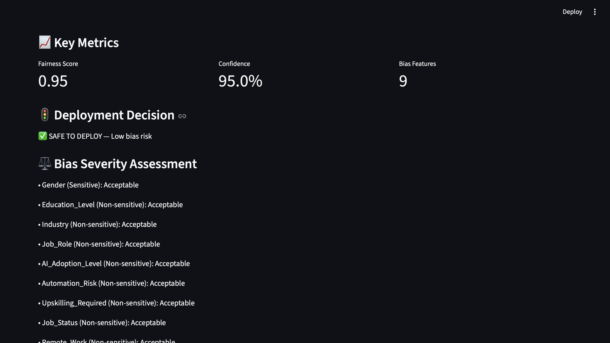
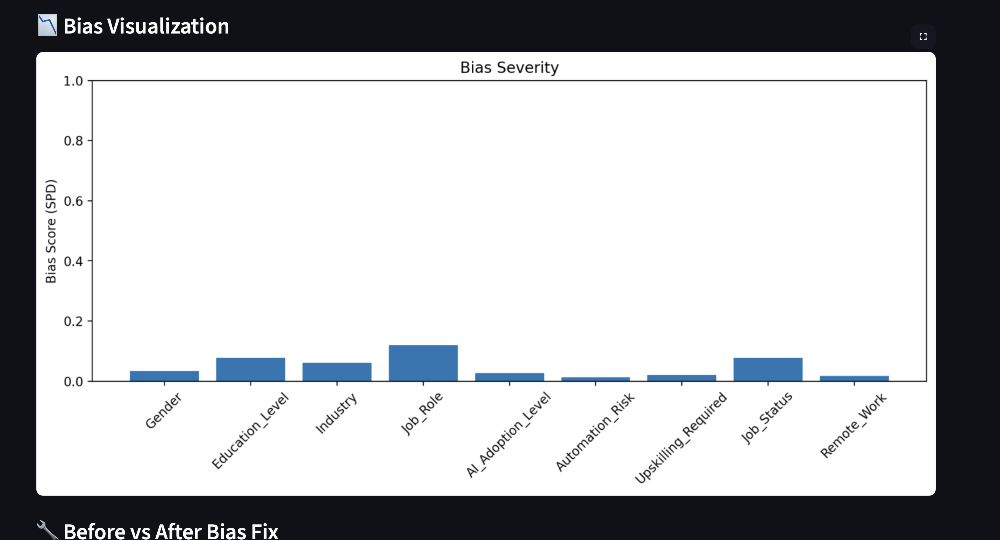
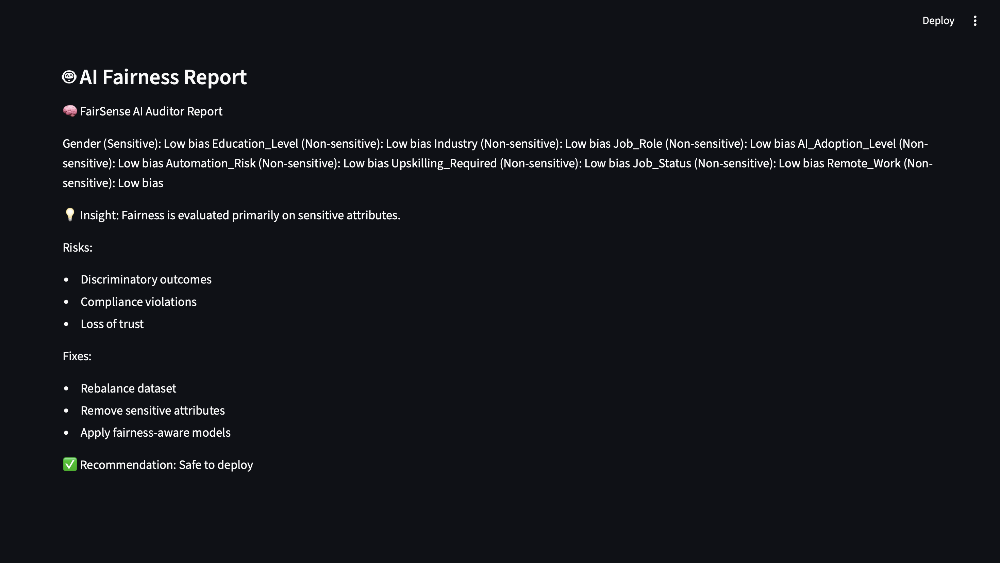

# FairSense AI

## 🚀 Overview

FairSense AI is an enterprise-level AI fairness auditing platform designed to detect, explain, evaluate, and simulate mitigation of bias in machine learning datasets.

The system analyzes uploaded datasets, evaluates fairness across sensitive attributes such as Gender, Race, and Age, and provides deployment recommendations based on fairness metrics.

The platform combines:
- Fairness auditing
- Bias visualization
- Risk assessment
- AI-generated reporting
- Bias mitigation simulation

into a single interactive dashboard built using Python and Streamlit.

---

## ✨ Features

- 📊 AI fairness auditing
- ⚖️ Bias severity analysis
- 🚦 Deployment decision support
- 📈 Interactive bias visualization
- 🤖 AI-generated fairness reports
- 🔧 Bias mitigation simulation
- 📥 Downloadable fairness reports
- 🧠 Sensitive attribute monitoring
- 📂 CSV dataset upload support
- 📋 Dashboard analytics

---

## 🛠️ Technologies Used

### Programming Language
- Python

### Framework
- Streamlit

### Libraries
- Pandas
- Matplotlib
- python-dotenv

### Concepts
- Fairness Auditing
- Statistical Parity Difference (SPD)
- Disparate Impact (DI)
- Bias Detection
- Responsible AI

---

## 📂 Project Structure

```text
FairSense-AI/
│
├── app.py
├── README.md
├── requirements.txt
├── .gitignore
└── screenshots/
    ├── Dashboard.png
    ├── Decision.png
    ├── Graph.png
    └── Report.png
```

---

## ⚙️ Installation

Clone the repository:

```bash
git clone https://github.com/aswinmanoj07/FairSense-AI.git
cd FairSense-AI
```

Install dependencies:

```bash
pip install -r requirements.txt
```

---

## ▶️ Run the Application

```bash
streamlit run app.py
```

The application will open in your browser automatically.

---

## 📊 Fairness Metrics Used

### Statistical Parity Difference (SPD)
Measures disparity between demographic groups.

### Disparate Impact (DI)
Measures fairness ratio between groups.

---

## 📸 Screenshots

### Dashboard



---

### Deployment Decision



---

### Bias Visualization



---

### AI Fairness Report



---

## 🧠 Methodology

1. Upload dataset
2. Select target column
3. Detect fairness bias
4. Calculate SPD and DI metrics
5. Evaluate deployment safety
6. Visualize bias severity
7. Generate AI fairness report
8. Simulate bias mitigation

---

## 🚦 Deployment Decision Logic

The system evaluates:
- Sensitive feature bias
- Fairness score
- Bias thresholds

Possible outcomes:
- ✅ SAFE TO DEPLOY
- ⚠️ DEPLOY WITH CAUTION
- ❌ DO NOT DEPLOY

---

## 🔧 Bias Mitigation Simulation

The platform simulates fairness improvements by:
- reducing SPD values,
- improving DI values,
- and demonstrating potential mitigation impact.

---

## 🌍 Applications

- Responsible AI systems
- Enterprise ML auditing
- HR analytics fairness
- Financial decision systems
- AI compliance monitoring
- Ethical AI research

---

## 🔮 Future Improvements

- Real-time monitoring
- Advanced ML fairness metrics
- Multi-model comparison
- Cloud deployment
- PDF report generation
- Explainable AI integration
- Interactive dashboards
- Deep learning fairness analysis

---

## 👨‍💻 Author

Aswin K M  
B.Tech Computer Science and Engineering 

---

## 📜 License

This project is licensed under the MIT License.
